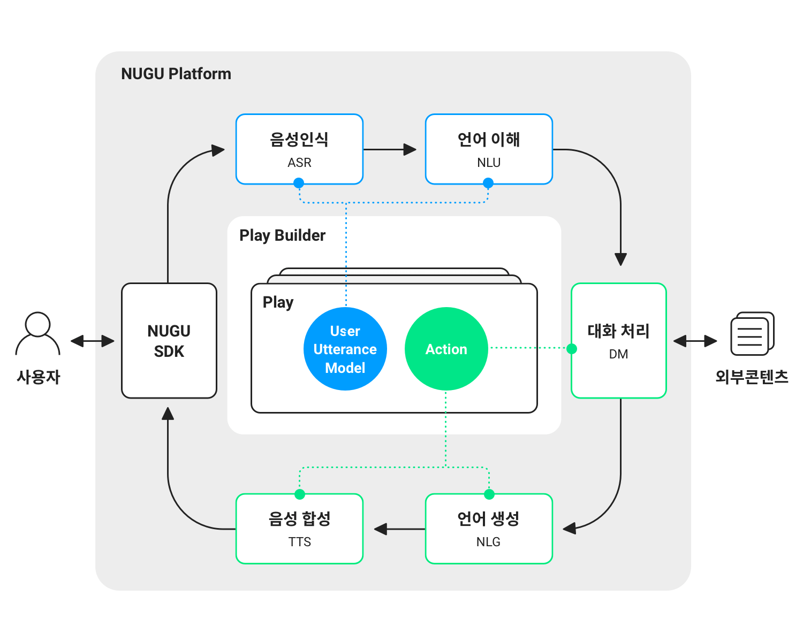

# 구성 component




caption caption





Play 생성 시에 이 호출 이름을 정의해야 하고, 호출 이름에 대한 자세한 내용은 [호출 이름 정의하기](nugu-play/play-registration-and-review/register-a-play.md#define-an-invocation-name)를 참고하면 됩니다.



Play 생성 시에 이 호출 이름을 정의해야 하고, 호출 이름에 대한 자세한 내용은 [호출 이름 정의하기](nugu-play/play-registration-and-review/register-a-play.md#define-an-invocation-name)를 참고하면 됩니다.



Play 생성 시에 이 호출 이름을 정의해야 하고, 호출 이름에 대한 자세한 내용은 [호출 이름 정의하기](nugu-play/play-registration-and-review/register-a-play.md#define-an-invocation-name)를 참고하면 됩니다.



Play 생성 시에 이 호출 이름을 정의해야 하고, 호출 이름에 대한 자세한 내용은 [호출 이름 정의하기](nugu-play/play-registration-and-review/register-a-play.md#define-an-invocation-name)를 참고하면 됩니다.



```bash
     private init() { 
         NuguServerInfo.l4SwitchAddress = "https://review-dghttp.sktnugu.com"
     }
```




NuguAndroidClient instance 를 통해 SoundAgent instance 에 접근할 수 있습니다.

```
class MySoundProvider: SoundProvider {
    ...
}
NuguAndroidClient.Builder(...)
    .enableSound(MySoundProvider())
```



NuguAndroidClient 생성시 SoundProvider 를 추가합니다.

```
val soundAgent = nuguAndroidClient.getAgent(DefaultSoundAgent.NAMESPACE)
```



<details>

<summary>Expandable</summary>

content

</details>

$$
f(x) = x * e^{2 pi i \xi x}
$$



description



desc



desc



desc



123321







```javascript
{
    // Response
}
```



```javascript
{
    // Response
}
```



```javascript
{
    // Response
}
```



```javascript
{
    // Response
}
```



inline image  inline math $$f(x) = x * e^{2 pi i \xi x}$$
