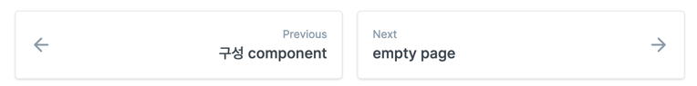

# 디자인 가이드

## Title 영역

Title 영역은 본문의 최상단에 위치하며, 본문 제목, 설명으로 구성됩니다.

## 본문 영역

### 문단 제목

문단 제목은 6level로 구성되어 있으며, 각각은 크기가 다릅니다. 다만 gitbook의 경우 3level이후부터는 동일한 크기로 표현됩니다. 또한 좌측 영역에 복사 아이콘이 포함되어 있습니다.

아래는 기본적으로 지원하는 제목 영역입니다.

# 제목 1

## 제목 2

### 제목 3 : 4\~6까지 차이가 없으나, 있어도 상관없음

#### 제목 4

##### 제목 5

###### 제목 6

### 문단 본문

문단 본문은 일반적으로 텍스트로 구성되며, 경우에 따라 이미지, 수식기호등이 포함될 수 있습니다. 따라서 문단내 행간은 가변적으로 조정이 될 수 있습니다.

이건 위 문단과 다른 문단입니다. 이렇게 문단내 행간과 명확히 구분이 됩니다.

또한 이렇게  와 같은 이미지,나 $$f(x) = x * e^{2 pi i \xi x}$$ 과 같은 수식기호, [링크](https://google.com)를 넣을 수 있습니다.

문단 본문에 위와 같이 inline으로 문자가 아닌 요소들이 표현될 경우 최대 사이즈를 기준으로 표현됩니다. 예를 들어 width, height가 100, 100까지만 허용한다면, ratio를 유지한 채로 작은 경우 기본 사이즈를, 큰 경우 최대 사이즈로 표현됩니다.

마지막으로 디자인적으로 중요하지는 않을 것 같긴 하지만 _이텔릭체_, **볼드**, ~~취소~~, `강조` 를 사용할 수 있습니다.

### 리스트

리스트는 아래와 같이 표현됩니다.

1. 순서가 필요한 목록
2. 순서가 필요한 목록
   * 순서가 필요하지 않은 목록(서브)
   * 순서가 필요하지 않은 목록(서브)
3. 순서가 필요한 목록
   * 순서가 필요하지 않은 목록(서브)
     * 순서가 필요하지 않은 목록(서브)
       * 순서가 필요하지 않은 목록(서브)
       * 순서가 필요하지 않은 목록(서브)
         * 순서가 필요하지 않은 목록(서브)
         * 순서가 필요하지 않은 목록(서브)
     * 순서가 필요하지 않은 목록(서브)
   * 순서가 필요하지 않은 목록(서브)
4. 순서가 필요한 목록(서브)
5. 순서가 필요한 목록(서브)
6. 순서가 필요한 목록

### 인용

인용 영역은 아래와 같이 들여쓰여진 공간을 말합니다.

> 이렇게 위 내용을 좀 더 설명하기 위해 사용됩니다.
>
> > 그리고 몇 단계의 depth로 구성됩니다.
> >
> > > 3번째
> > >
> > > > 4번째
> > > >
> > > > > 마찬가지로 inline으로  나 $$f(x) = x * e^{2 pi i \xi x}$$ 와 같이 표현이 가능합니다.

### 테이블

일단 테이블은 우선 모든 모양이 동일하며, 아래와 같은 특징을 갖습니다.

* 다만 테이블내, 줄바꿈, 이미지 등이 포함될 수 있습니다. 이 경우 문단 본문과 마찬가지로 가변 행간, 최대 사이즈 기반으로 구성되면 됩니다.
* table cell은 좌우, 중간 정렬이 가능합니다.
* gitbook의 경우 제대로 표현되지 않습니다만, header, tbody 영역이 명확히 구분되어도 됩니다.

아래는 사용 예시입니다.

| 값          |           의미           |                                   기본값 |
| ---------- | :--------------------: | ------------------------------------: |
| `static`   |   유형(기준) 없음 / 배치 불가능   |                              `static` |
| `relative` |     요소 자신을 기준으로 배치     |  |
| `absolute` | 위치 상 부모(조상)요소를 기준으로 배치 |       $$f(x) = x * e^{2 pi i \xi x}$$ |
| `fixed`    |     브라우저 창을 기준으로 배치    |                                       |

### 이미지

이미지는 본문내 중앙 정렬이 된 채로 노출되며, 클릭시 상세화면으로 표현됩니다.


### 수식

아래와 같이 표현됩니다. gitbook의 경우 우측 정렬로 노출되지만 원칙적으로 inline으로 사용된 경우와 중앙으로 정렬할 수 있는 구문이 구분되어 있습니다.

$$f(x) = x * e^{2 pi i \xi x}$$

### 구분선

그냥 아래와 같이 구분된 선입니다.

---

안보이시죠? 원래는

# 위에 구분선이 보이시나요?

와 같이 노출이 되어야 하나 gitbook은 지원되지 않습니다. 하지만, 명확히 태그로 표현되기 때문에 노출되는 것이 좋겠습니다.

### 링크

아래와 같이 링크정보이며, 일반 문단내 본문과 동일하나, 링크임이 구분되면 됩니다.

[GOOGLE](https://google.com)

[NAVER](https://naver.com)

### 코드블럭

코드블럭은 아래와 같이 제목이 있는 경우와 없는 경우 아래와 같이 표현됩니다.

#### 제목이 있는 경우


```bash
     private init() { 
         NuguServerInfo.l4SwitchAddress = "https://review-dghttp.sktnugu.com"
     }
```


#### 제목이 없는 경우

```bash
     private init() { 
         NuguServerInfo.l4SwitchAddress = "https://review-dghttp.sktnugu.com"
     }
```

모두 우측 상단에 복사모양의 아이콘을 제공합니다.

### Youtube

기능상으로는 여러 링크를 걸 수 있는 기능이 존재합니다만, Youtube와 같이 바로 재생이 가능한 경우만 있으면 됩니다. 재생 화면 영역은 건드릴 필요없이 영역만 잡으면 될 것 같습니다.



### 내부 페이지 링크

내부 페이지 링크는 아래와 같이 표현됩니다.


[..](../)


### 외부 페이지 링크

외부 페이지 링크는 외부 페이지의 Title 영역과 설명으로 구성됩니다.



### 힌트


Play 생성 시에 이 호출 이름을 정의해야 하고, 호출 이름에 대한 자세한 내용은 [호출 이름 정의하기](nugu-play/play-registration-and-review/register-a-play.md#define-an-invocation-name)를 참고하면 됩니다.



Play 생성 시에 이 호출 이름을 정의해야 하고, 호출 이름에 대한 자세한 내용은 [호출 이름 정의하기](nugu-play/play-registration-and-review/register-a-play.md#define-an-invocation-name)를 참고하면 됩니다.



Play 생성 시에 이 호출 이름을 정의해야 하고, 호출 이름에 대한 자세한 내용은 [호출 이름 정의하기](nugu-play/play-registration-and-review/register-a-play.md#define-an-invocation-name)를 참고하면 됩니다.



Play 생성 시에 이 호출 이름을 정의해야 하고, 호출 이름에 대한 자세한 내용은 [호출 이름 정의하기](nugu-play/play-registration-and-review/register-a-play.md#define-an-invocation-name)를 참고하면 됩니다.


### Tab



NuguAndroidClient instance 를 통해 SoundAgent instance 에 접근할 수 있습니다.

```
class MySoundProvider: SoundProvider {
    ...
}
NuguAndroidClient.Builder(...)
    .enableSound(MySoundProvider())
```



NuguAndroidClient 생성시 SoundProvider 를 추가합니다.

```
val soundAgent = nuguAndroidClient.getAgent(DefaultSoundAgent.NAMESPACE)
```



### 확장

<details>

<summary>Expandable</summary>

content

</details>

### API



description



desc



desc



desc



123321







```javascript
{
    // Response
}
```



### File



### Navigation 영역




## 빈 본문 영역


